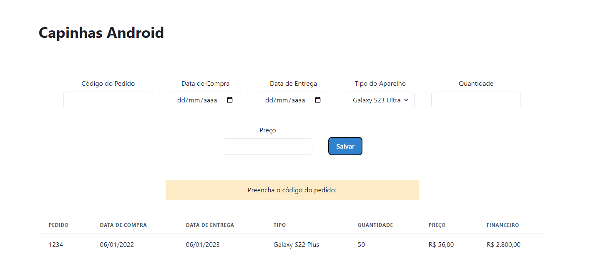

# Projeto Front-end com React

Este arquivo é parte da avaliação a disciplina Front-end com React e tem como objetivo apresentar o projeto criado

## Instalação

O projeto React desta disciplina foi criado utilizando o pacote Vite. 
As informações de documentação podem ser encontradas em <https://vitejs.dev/>.

Para fazer a instalação e subir o servidor, devem ser utilizados os seguintes comandos

```bash
cd react_projeto

npm install
npm run dev
```

## Chackra UI

Foram utilizados os componentes da biblioteca Chackra UI. Sua documentação pode ser encontrada em <https://v2.chakra-ui.com/>.

Para fazer a instalação da biblioteca deve ser utilizado o seguinte comando

```bash
npm i @chakra-ui/react @emotion/react @emotion/styled framer-motion
```

É possível verificar a lista completa no arquivo <code>./package.json</code>.


## Estrutura das pastas

A estrutura de pastas segue o seguinte layout

```bash   
│
└───components
│      header.tsx
│      formulario.tsx
│      tabela.tsx
│
└───pages
│      login.tsx
│      pedidos.tsx
│
└───shared
│      context.tsx
│      validation.tsx
│
```

<ul>
  <li><b>Components</b></li>
        Esta pasta possui os 3 principais componentes que serão renderizados no aplicativo (Header, Tabela e Formulário)
    <p>
  <li><b>Pages</b></li>
        O aplicativo se divide em duas páginas
    <ul>
      <li><b><i>login</i></b>: autenticação do usuário</li>
      <li><b><i>pedidos</i></b>: onde serão renderizados o formulário e a tabela</li>
    </ul>
    <p>
  <li><b>Shared</b>
    Esta pasta possui 2 arquivos:
    <ul>
      <li><b><i>context</i></b>: um compente que cria o contexto de dados que será utilizado no formulário e na tabela</li>
      <li><b><i>validation</i></b>: função responsável pela validação dos campos do formulário</li>
    </ul>
</li>
</ul>

## Layout da aplicação
A aplicação consiste num sistema de cadastro de pedidos de uma loja de capinhas de celulares. O usuário pode realizar manualmente o cadastro de pedidos de compra, preenchendo 6 campos de informações.

Os campos são:
<ul><b>
  <li>Código do pedido</li>
  <li>Data da Compra</li>
  <li>Data da Entrega</li>
  <li>Tipo da Capinha</li>
  <li>Quantidade de Capinhas</li>
  <li>Preço Unitário por Capinha</li>
  </b>
</ul>

Ao preencher corretamente os campos do formulário, uma lista de pedidos salva em memória é atualizada e o componente da tabela é renderizado com o novo contexto.

No estado inicial da aplicação, uma linha de exemplo com o pedido de número 1234 já está preenchida na tabela. A coluna Financeiro é calculada automaticamente a partir da multiplicação da quantidade e do preço unitário.


## Validação de formulários

Foram realizadas validações tanto para o preenchimento quanto para o salvamento das informações preenchidas. 

Por exemplo, campos numéricos só podem ser preenchidos com números. Campos de data só podem ser preenchidos com datas.

Ao tentar realizar o cadastro com informações incorretas, uma mensagem de aviso aparece para o usuário.




Quando todas as validações estão corretas, o cadastro é realizado e uma mensagem de sucesso aparece para o usuário.


